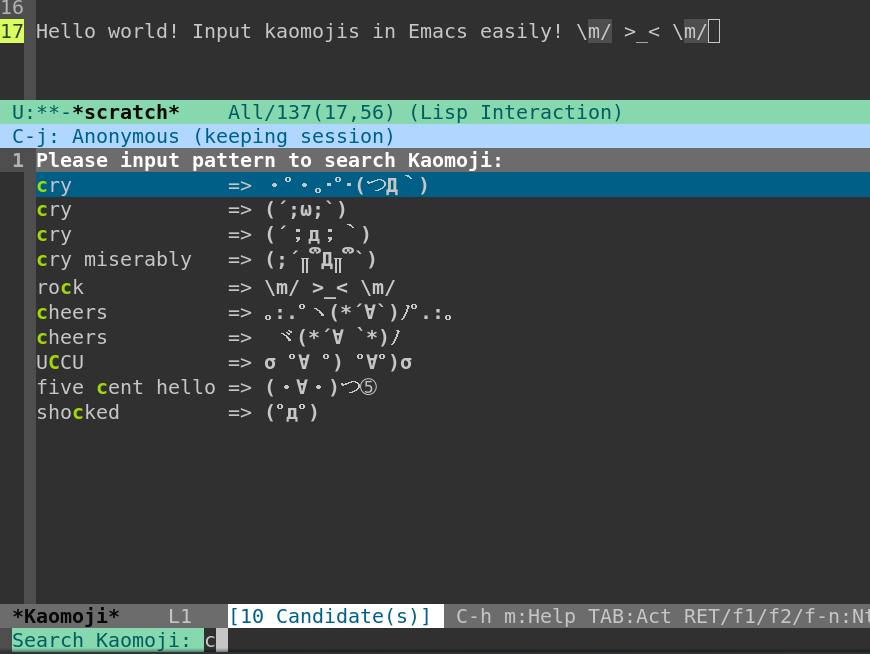

[](http://www.wtfpl.net/)
[](https://jcs-emacs.github.io/jcs-elpa/#/kaomoji)

# Kaomoji.el - Input Kaomoji (顔文字) Easily!

[](https://github.com/elp-revive/kaomoji.el/actions/workflows/test.yml)

## Screenshot



## Requirement

- Emacs (tested on 24.5)
- Helm (tested on 1.9.1)

## Installation

`(require 'kaomoji)`, then `M-x kaomoji` to input kaomoji.
You can search kaomoji via their aliases.

## Customization

- `kaomoji-table` : The main table contains kaomojis & their aliases `(((ALIASES... ) . KAOMOJI) ...)`

You can set multiple alias (e.g. in different languages) for the same kaomoji.

You can customize like this to append new items to this talbe:

```elisp
(setq kaomoji-table
      (append '((("angry" "furious") . "(／‵Д′)／~ ╧╧ ")
                (("angry" "punch") . "#ﾟÅﾟ）⊂彡☆))ﾟДﾟ)･∵"))
              kaomoji-table))
```

- `kaomoji-patterns-inserted-along-with`

  When your input (from Helm minibuffer) contains any of the patterns,
  insert the input along with the kaomoji.

  This function can be disabled by setting to nil.

- `kaomoji-insert-user-input-at` : set it to `left-side` or `right-side`

## License

WTFPL 3.14159 or 2.0
